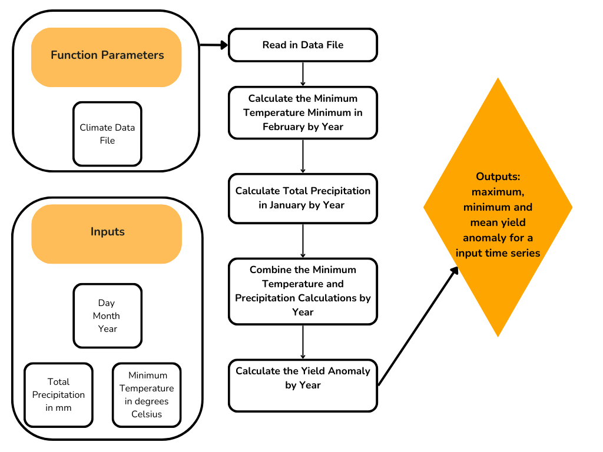

```{r, results = 'hide', warning = FALSE, message =  FALSE}
# Load packages
library(tidyverse)

# Import the almond yield function
source("almond_yield_anomaly.R")
```


```{r, warning = FALSE, message =  FALSE}
# Example usage
almond_yield_anomaly("data/clim.txt")
```


